# MCPSecTrace 架构图 - Mermaid 版本

本文档包含《MCPSecTrace部署运维指南》中所有图表的 Mermaid 代码。

---

## 1. 整体架构图

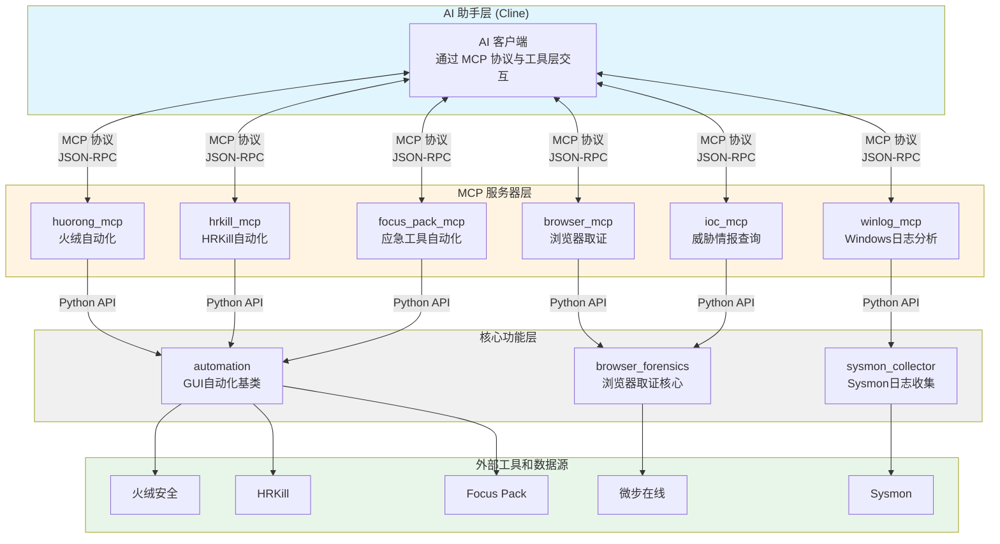

---

## 2. MCP 通信流程图

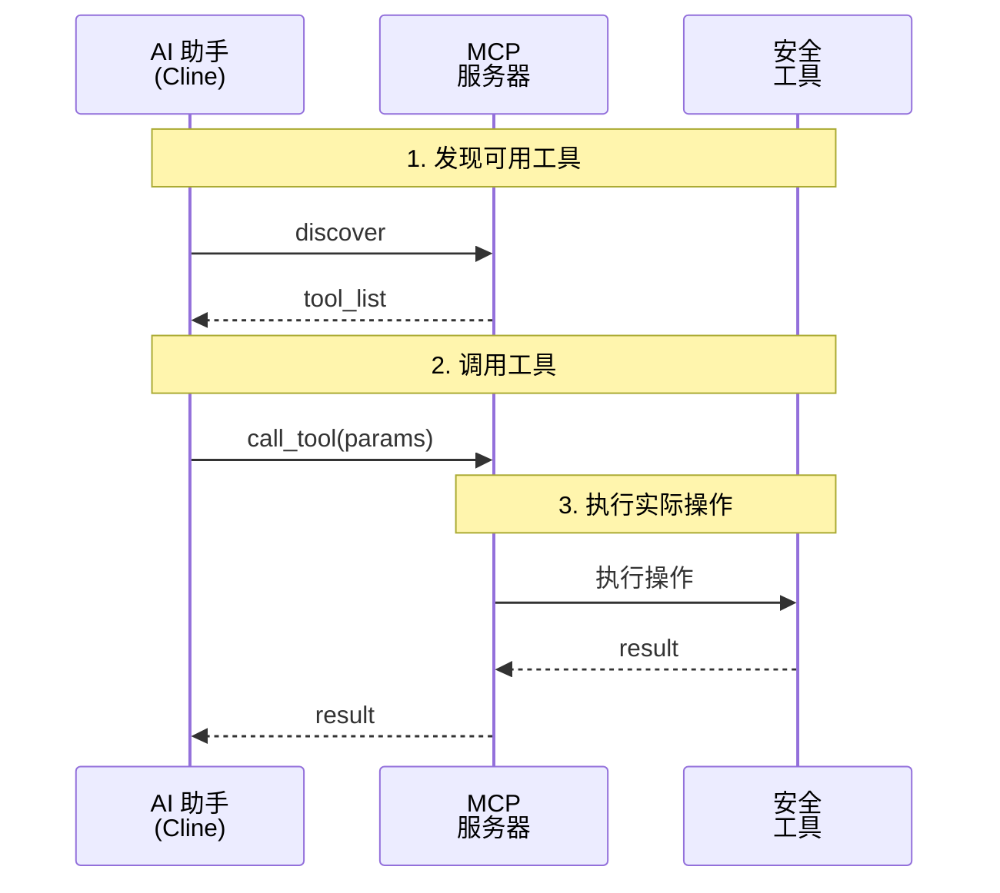

---

## 3. 浏览器取证流程图

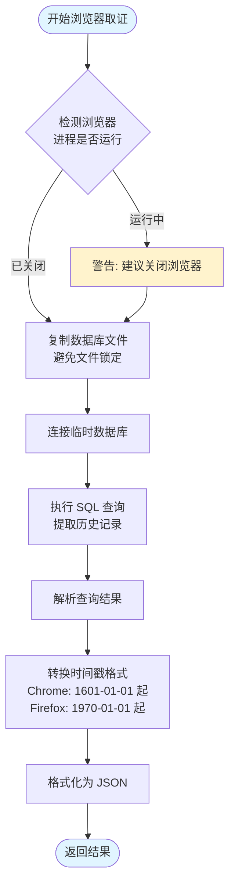

---

## 4. GUI 自动化流程图

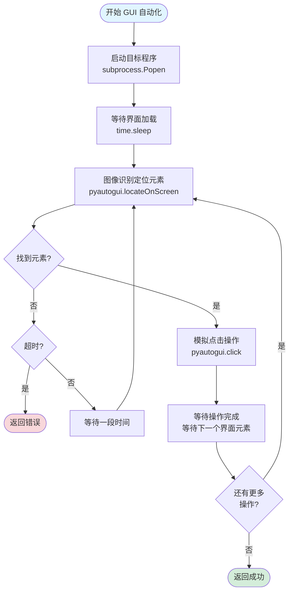

---

## 5. 威胁情报查询流程图

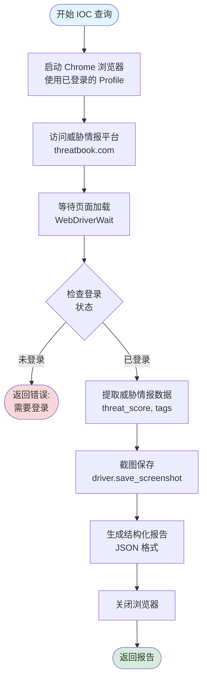

---

## 6. 部署流程图

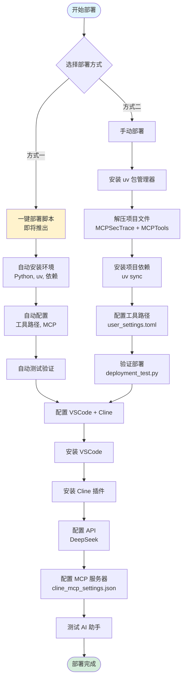

---

## 7. 功能测试流程图

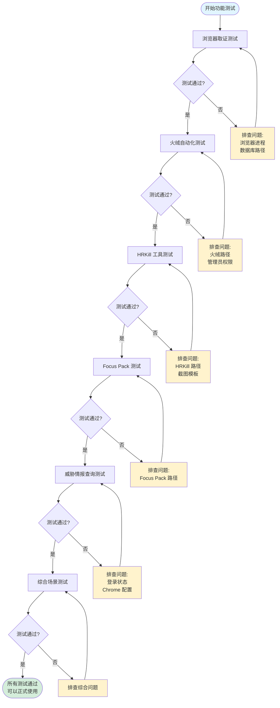

---

## 8. 问题诊断流程图

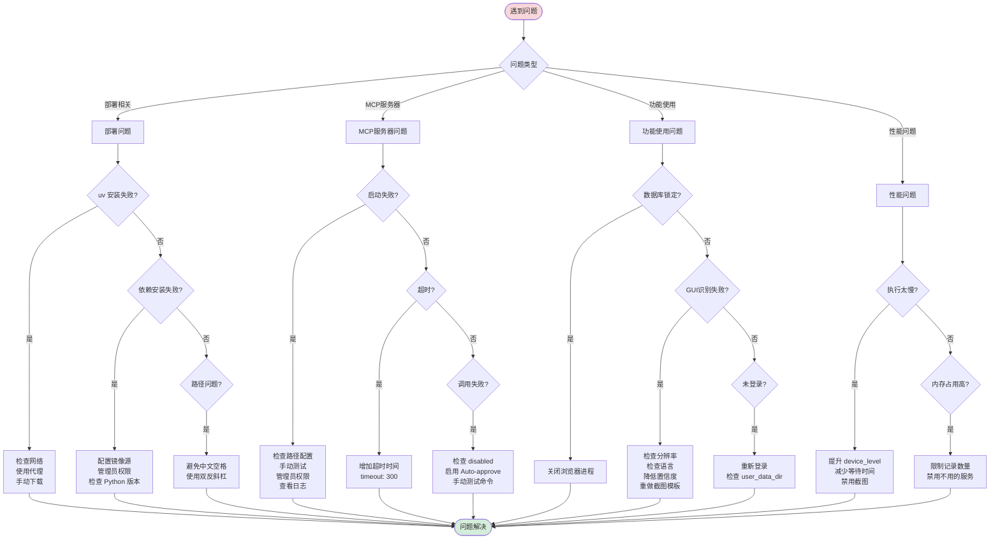

---

## 9. 数据流图 - 浏览器取证

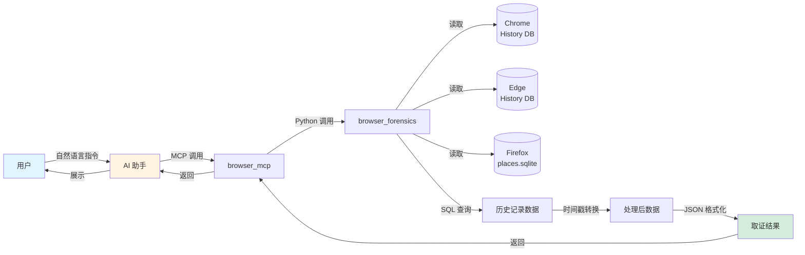

---

## 10. 数据流图 - 威胁情报查询

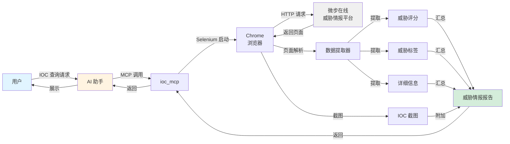

---

## 11. 配置文件层次结构

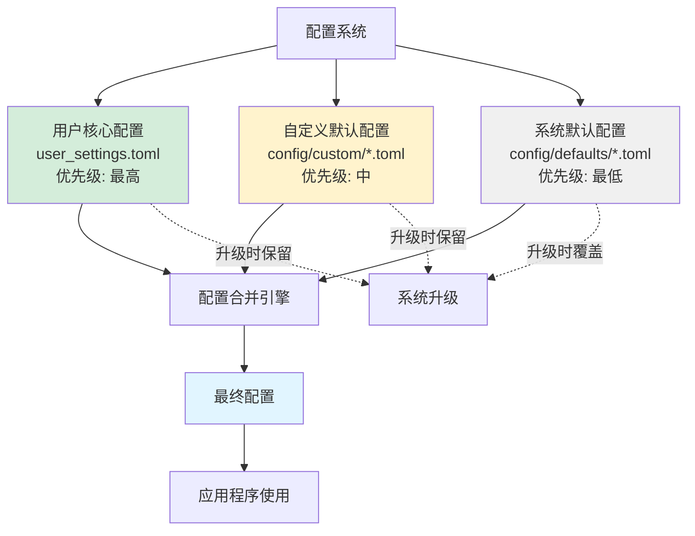

---

## 12. MCP 服务器启动流程

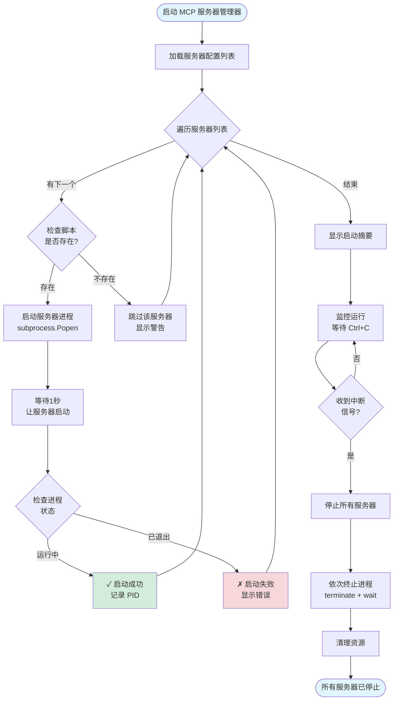

---

## 使用说明

### 如何在 Markdown 中使用这些图表

1. **复制对应的 Mermaid 代码块**
2. **粘贴到 Markdown 文件中**
3. **确保使用 ` ```mermaid ` 代码块包裹**

### 支持的平台

- ✅ GitHub (原生支持)
- ✅ GitLab (原生支持)
- ✅ VSCode (需安装 Mermaid 预览插件)
- ✅ Typora (原生支持)
- ✅ Obsidian (原生支持)
- ✅ Notion (部分支持)

### 在线编辑器

如需调整图表,可使用:
- https://mermaid.live/ - 官方在线编辑器
- https://mermaid-js.github.io/mermaid-live-editor/ - 实时预览

---

## 图表索引

| 编号 | 图表名称 | 所在章节 | 类型 |
|------|---------|---------|------|
| 1 | 整体架构图 | 2.1 | flowchart |
| 2 | MCP 通信流程图 | 3.1 | sequenceDiagram |
| 3 | 浏览器取证流程图 | 3.2 | flowchart |
| 4 | GUI 自动化流程图 | 3.3 | flowchart |
| 5 | 威胁情报查询流程图 | 3.4 | flowchart |
| 6 | 部署流程图 | 4.2 | flowchart |
| 7 | 功能测试流程图 | 5 | flowchart |
| 8 | 问题诊断流程图 | 6 | flowchart |
| 9 | 数据流图 - 浏览器取证 | - | flowchart |
| 10 | 数据流图 - 威胁情报查询 | - | flowchart |
| 11 | 配置文件层次结构 | - | flowchart |
| 12 | MCP 服务器启动流程 | - | flowchart |

---

**文档版本**: 1.0
**创建日期**: 2025年12月11日
