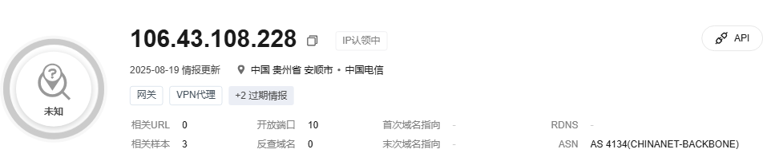
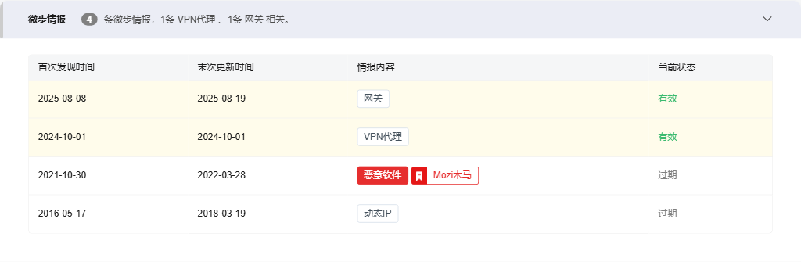
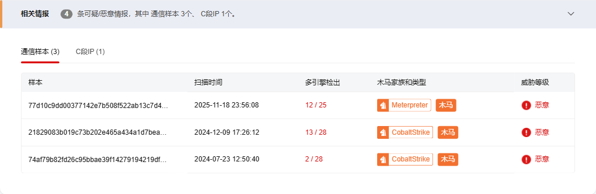
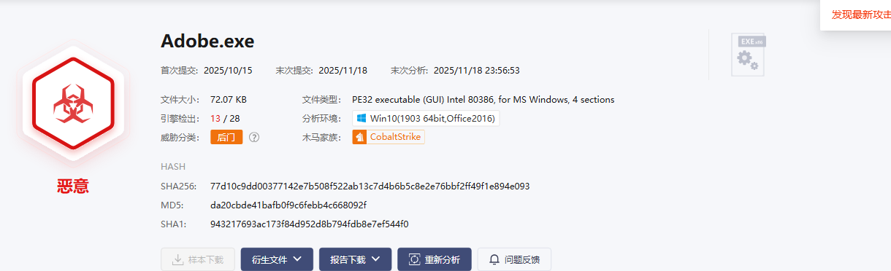
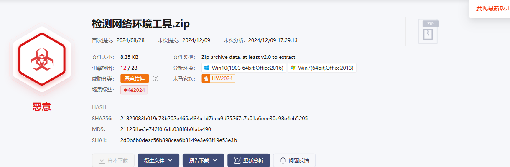
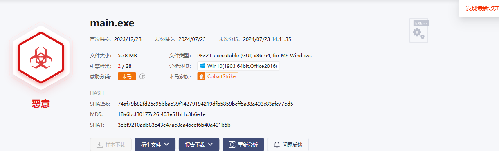

# IP 威胁分析报告

**目标**: 106.43.108.228  
**查询时间**: 2025-11-18 23:58:01  
**数据来源**: 微步在线威胁情报平台

---

## 基本信息

## 情报洞察

---

## 威胁情报详情

### 微步情报

### 相关情报

---

## 相关样本

**相关样本数量**: 3

| 文件名称 | 类型 | 扫描时间 | SHA256 | 多引擎检出 | 木马家族和类型 | 威胁等级 |
| --- | --- | --- | --- | --- | --- | --- |
| Adobe.exe | EXEx86 | 2025-11-18 23:56:08 | 77d10c9dd00377142e7b508f522ab13c7d4b6b5c8e2e76bbf2ff49f1e894e093 | 12 / 25 | Meterpreter木马 | 恶意 |
| 检测网络环境工具.zip | Zip | 2024-12-09 17:26:12 | 21829083b019c73b202e465a434a1d7bea9d25267c7a01a6eee30e98e4eb5205 | 13 / 28 | CobaltStrike木马 | 恶意 |
| main.exe | EXEx64 | 2024-07-23 12:50:40 | 74af79b82fd26c95bbae39f14279194219dfb5859bcff5a88a403c83afc77ed5 | 2 / 28 | CobaltStrike木马 | 恶意 |

💾 详细数据已保存为CSV文件: `106.43.108.228_threat_data.csv`

---

## 样本常见释放路径分析

### SHA256: 77d10c9dd00377142e7b508f522ab13c7d4b6b5c8e2e76bbf2ff49f1e894e093

#### Win10(1903 64bit,Office2016)环境下常见释放路径

⚠️ 获取文件常见释放路径失败: Message: no such element: Unable to locate element: {"method":"css selector","selector":"tbody.ant-table-tbody"}
  (Session info: chrome=139.0.7258.5); For documentation on this error, please visit: https://www.selenium.dev/documentation/webdriver/troubleshooting/errors#nosuchelementexception
Stacktrace:
	GetHandleVerifier [0x0x7ff6b1d70c95+79605]
	GetHandleVerifier [0x0x7ff6b1d70cf0+79696]
	(No symbol) [0x0x7ff6b1b0c20a]
	(No symbol) [0x0x7ff6b1b62bf6]
	(No symbol) [0x0x7ff6b1b62eac]
	(No symbol) [0x0x7ff6b1b556ec]
	(No symbol) [0x0x7ff6b1b8ae2f]
	(No symbol) [0x0x7ff6b1b555b6]
	(No symbol) [0x0x7ff6b1b8b000]
	(No symbol) [0x0x7ff6b1bb301b]
	(No symbol) [0x0x7ff6b1b8abc3]
	(No symbol) [0x0x7ff6b1b53de1]
	(No symbol) [0x0x7ff6b1b54b73]
	GetHandleVerifier [0x0x7ff6b203307d+2972381]
	GetHandleVerifier [0x0x7ff6b202d3cd+2948653]
	GetHandleVerifier [0x0x7ff6b204c1ad+3075085]
	GetHandleVerifier [0x0x7ff6b1d8a77e+184798]
	GetHandleVerifier [0x0x7ff6b1d9264f+217263]
	GetHandleVerifier [0x0x7ff6b1d793e4+114244]
	GetHandleVerifier [0x0x7ff6b1d79599+114681]
	GetHandleVerifier [0x0x7ff6b1d60078+10968]
	BaseThreadInitThunk [0x0x7ffd1b5ce8d7+23]
	RtlUserThreadStart [0x0x7ffd1c82c53c+44]

### SHA256: 21829083b019c73b202e465a434a1d7bea9d25267c7a01a6eee30e98e4eb5205

#### Win10(1903 64bit,Office2016)环境下常见释放路径

⚠️ 获取文件常见释放路径失败: Message: no such element: Unable to locate element: {"method":"css selector","selector":"tbody.ant-table-tbody"}
  (Session info: chrome=139.0.7258.5); For documentation on this error, please visit: https://www.selenium.dev/documentation/webdriver/troubleshooting/errors#nosuchelementexception
Stacktrace:
	GetHandleVerifier [0x0x7ff6b1d70c95+79605]
	GetHandleVerifier [0x0x7ff6b1d70cf0+79696]
	(No symbol) [0x0x7ff6b1b0c20a]
	(No symbol) [0x0x7ff6b1b62bf6]
	(No symbol) [0x0x7ff6b1b62eac]
	(No symbol) [0x0x7ff6b1b556ec]
	(No symbol) [0x0x7ff6b1b8ae2f]
	(No symbol) [0x0x7ff6b1b555b6]
	(No symbol) [0x0x7ff6b1b8b000]
	(No symbol) [0x0x7ff6b1bb301b]
	(No symbol) [0x0x7ff6b1b8abc3]
	(No symbol) [0x0x7ff6b1b53de1]
	(No symbol) [0x0x7ff6b1b54b73]
	GetHandleVerifier [0x0x7ff6b203307d+2972381]
	GetHandleVerifier [0x0x7ff6b202d3cd+2948653]
	GetHandleVerifier [0x0x7ff6b204c1ad+3075085]
	GetHandleVerifier [0x0x7ff6b1d8a77e+184798]
	GetHandleVerifier [0x0x7ff6b1d9264f+217263]
	GetHandleVerifier [0x0x7ff6b1d793e4+114244]
	GetHandleVerifier [0x0x7ff6b1d79599+114681]
	GetHandleVerifier [0x0x7ff6b1d60078+10968]
	BaseThreadInitThunk [0x0x7ffd1b5ce8d7+23]
	RtlUserThreadStart [0x0x7ffd1c82c53c+44]

#### Win7(64bit,Office2013)环境下常见释放路径

⚠️ 获取文件常见释放路径失败: Message: no such element: Unable to locate element: {"method":"css selector","selector":"tbody.ant-table-tbody"}
  (Session info: chrome=139.0.7258.5); For documentation on this error, please visit: https://www.selenium.dev/documentation/webdriver/troubleshooting/errors#nosuchelementexception
Stacktrace:
	GetHandleVerifier [0x0x7ff6b1d70c95+79605]
	GetHandleVerifier [0x0x7ff6b1d70cf0+79696]
	(No symbol) [0x0x7ff6b1b0c20a]
	(No symbol) [0x0x7ff6b1b62bf6]
	(No symbol) [0x0x7ff6b1b62eac]
	(No symbol) [0x0x7ff6b1b556ec]
	(No symbol) [0x0x7ff6b1b8ae2f]
	(No symbol) [0x0x7ff6b1b555b6]
	(No symbol) [0x0x7ff6b1b8b000]
	(No symbol) [0x0x7ff6b1bb301b]
	(No symbol) [0x0x7ff6b1b8abc3]
	(No symbol) [0x0x7ff6b1b53de1]
	(No symbol) [0x0x7ff6b1b54b73]
	GetHandleVerifier [0x0x7ff6b203307d+2972381]
	GetHandleVerifier [0x0x7ff6b202d3cd+2948653]
	GetHandleVerifier [0x0x7ff6b204c1ad+3075085]
	GetHandleVerifier [0x0x7ff6b1d8a77e+184798]
	GetHandleVerifier [0x0x7ff6b1d9264f+217263]
	GetHandleVerifier [0x0x7ff6b1d793e4+114244]
	GetHandleVerifier [0x0x7ff6b1d79599+114681]
	GetHandleVerifier [0x0x7ff6b1d60078+10968]
	BaseThreadInitThunk [0x0x7ffd1b5ce8d7+23]
	RtlUserThreadStart [0x0x7ffd1c82c53c+44]

### SHA256: 74af79b82fd26c95bbae39f14279194219dfb5859bcff5a88a403c83afc77ed5

#### Win10(1903 64bit,Office2016)环境下常见释放路径

⚠️ 获取文件常见释放路径失败: Message: no such element: Unable to locate element: {"method":"css selector","selector":"tbody.ant-table-tbody"}
  (Session info: chrome=139.0.7258.5); For documentation on this error, please visit: https://www.selenium.dev/documentation/webdriver/troubleshooting/errors#nosuchelementexception
Stacktrace:
	GetHandleVerifier [0x0x7ff6b1d70c95+79605]
	GetHandleVerifier [0x0x7ff6b1d70cf0+79696]
	(No symbol) [0x0x7ff6b1b0c20a]
	(No symbol) [0x0x7ff6b1b62bf6]
	(No symbol) [0x0x7ff6b1b62eac]
	(No symbol) [0x0x7ff6b1b556ec]
	(No symbol) [0x0x7ff6b1b8ae2f]
	(No symbol) [0x0x7ff6b1b555b6]
	(No symbol) [0x0x7ff6b1b8b000]
	(No symbol) [0x0x7ff6b1bb301b]
	(No symbol) [0x0x7ff6b1b8abc3]
	(No symbol) [0x0x7ff6b1b53de1]
	(No symbol) [0x0x7ff6b1b54b73]
	GetHandleVerifier [0x0x7ff6b203307d+2972381]
	GetHandleVerifier [0x0x7ff6b202d3cd+2948653]
	GetHandleVerifier [0x0x7ff6b204c1ad+3075085]
	GetHandleVerifier [0x0x7ff6b1d8a77e+184798]
	GetHandleVerifier [0x0x7ff6b1d9264f+217263]
	GetHandleVerifier [0x0x7ff6b1d793e4+114244]
	GetHandleVerifier [0x0x7ff6b1d79599+114681]
	GetHandleVerifier [0x0x7ff6b1d60078+10968]
	BaseThreadInitThunk [0x0x7ffd1b5ce8d7+23]
	RtlUserThreadStart [0x0x7ffd1c82c53c+44]

