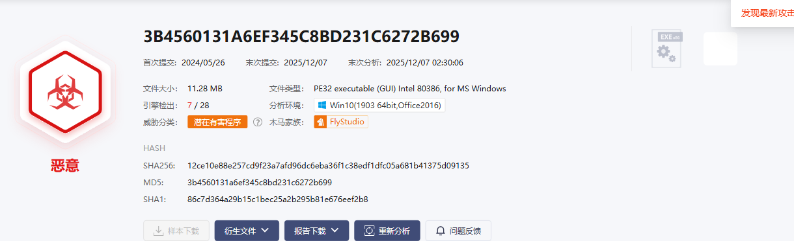

# IP 威胁分析报告

**目标**: 221.194.131.179  
**查询时间**: 2025-12-17 11:14:19  
**数据来源**: 微步在线威胁情报平台

---

## 基本信息

## 情报洞察

---

## 威胁情报详情

### 微步情报

### 相关情报

### 开源情报

---

## 相关样本

**相关样本数量**: 1

| 文件名称 | 类型 | 扫描时间 | SHA256 | 多引擎检出 | 木马家族和类型 | 威胁等级 |
| --- | --- | --- | --- | --- | --- | --- |
| 3B4560131A6EF345C8BD231C6272B699 | EXEx86 | 2025-12-17 01:51:37 | 12ce10e88e257cd9f23a7afd96dc6eba36f1c38edf1dfc05a681b41375d09135 | 6 / 28 | FlyStudio潜在有害程序 | 恶意 |

💾 详细数据已保存为CSV文件: `221.194.131.179_threat_data.csv`

---

## 样本常见释放路径分析

### SHA256: 12ce10e88e257cd9f23a7afd96dc6eba36f1c38edf1dfc05a681b41375d09135

#### Win10(1903 64bit,Office2016)环境下常见释放路径

暂时没有文件的常见释放路径

---

## AI分析报告

### 威胁概况分析
IP地址 `221.194.131.179` 被标记为恶意IP，关联到FlyStudio家族的潜在有害程序。该威胁具有以下特征：

1. **威胁类型**：远控木马（RAT，Remote Access Trojan）
2. **样本特征**：
   - 文件类型：Windows可执行文件（EXE x86架构）
   - SHA256：`12ce10e88e257cd9f23a7afd96dc6eba36f1c38edf1dfc05a681b41375d09135`
   - 木马家族：FlyStudio潜在有害程序
   - 多引擎检出率：6/28（21.4%），表明可能具有免杀特性

### 风险评估
1. **威胁等级**：高
   - 远控木马可提供攻击者对受害主机的完全控制权限
   - 低检出率意味着传统杀毒软件可能无法有效检测
   - FlyStudio家族通常用于窃取信息、远程控制、键盘记录等恶意活动

2. **潜在危害**：
   - 数据窃取：窃取敏感文件、凭证信息
   - 系统控制：远程执行命令、安装其他恶意软件
   - 持久化驻留：通过注册表、计划任务等方式实现开机自启
   - 横向移动：在内部网络传播感染其他主机

### 调查建议
基于威胁情报，建议进行以下应急响应操作：

1. **网络流量分析**：
   - 检查当前系统与 `221.194.131.179` 的网络连接
   - 使用 `netstat` 和 `Get-NetTCPConnection` 命令定位恶意进程

2. **文件系统检查**：
   - 搜索SHA256为 `12ce10e88e257cd9f23a7afd96dc6eba36f1c38edf1dfc05a681b41375d09135` 的文件
   - 检查临时目录、用户AppData等常见恶意软件藏匿位置

3. **进程分析**：
   - 查找可疑进程，特别是与FlyStudio相关的进程
   - 检查进程命令行参数、父进程关系

4. **持久化机制检查**：
   - 检查注册表启动项（Run/RunOnce）
   - 检查计划任务中的可疑任务
   - 检查系统服务中的异常服务

5. **安全日志分析**：
   - 查询Security日志中的进程创建事件（Event ID 4688）
   - 检查用户登录事件（Event ID 4624）

6. **账户安全检查**：
   - 检查是否存在可疑本地账户
   - 验证管理员组成员

### 缓解措施
1. **立即隔离**：如果发现感染，立即隔离受感染主机
2. **样本固定**：对发现的恶意文件计算哈希值，保留取证证据
3. **全面查杀**：使用专业杀毒工具进行深度扫描
4. **系统恢复**：清除持久化机制，恢复系统到安全状态

### 结论
该IP地址关联的FlyStudio远控木马对系统安全构成严重威胁。低检出率表明其可能采用免杀技术，需要结合行为分析和深度取证进行检测。建议按照工作流步骤进行全面溯源调查。

**分析时间**：2025-12-17 11:15:07  
**分析师**：Cybereye-Agent
