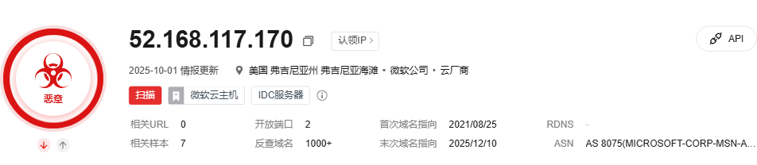
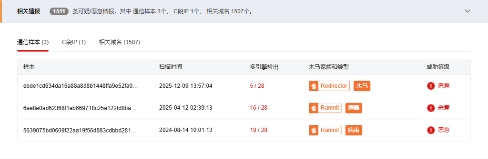
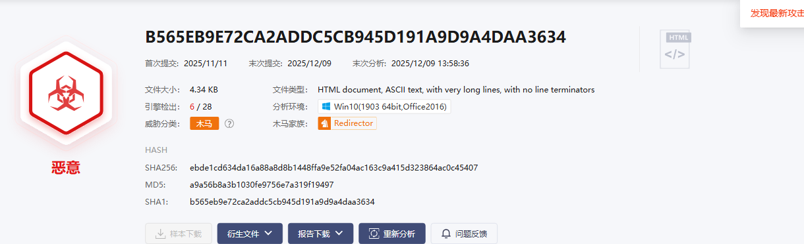
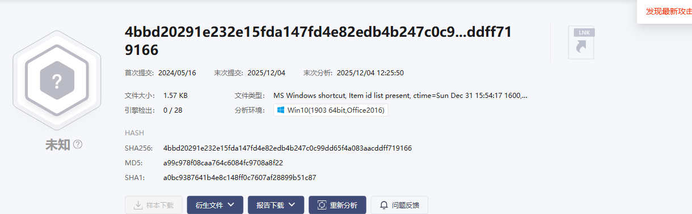
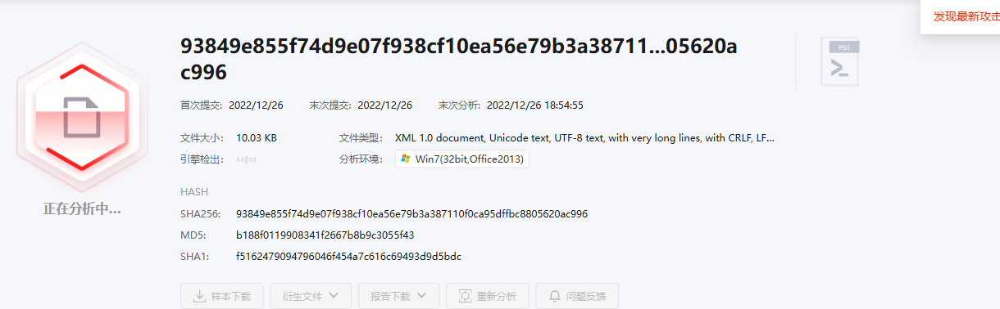

# IP 威胁分析报告

**目标**: 52.168.117.170  
**查询时间**: 2025-12-11 02:28:55  
**数据来源**: 微步在线威胁情报平台

---

## 基本信息

## 情报洞察

---

## 威胁情报详情

### 微步情报

### 相关情报

### 安全博客

---

## 相关样本

**相关样本数量**: 7

📝 由于数量限制，我们只获取第一页的内容。

| 文件名称 | 类型 | 扫描时间 | SHA256 | 多引擎检出 | 木马家族和类型 | 威胁等级 |
| --- | --- | --- | --- | --- | --- | --- |
| B565EB9E72CA2ADDC5CB945D191A9D9A4DAA3634 | HTML Document | 2025-12-09 13:57:04 | ebde1cd634da16a88a8d8b1448ffa9e52fa04ac163c9a415d323864ac0c45407 | 5 / 28 | Redirector木马 | 恶意 |
| 23fb8e829794d3220adf75caa8b31c7dd9352f87.bin | DLLx86 | 2025-04-12 02:39:13 | 6ae8e0ad62368f1ab669718c25e122fd8ba1cb5590943ffc4b42bbbc6dcf9509 | 16 / 28 | Ramnit病毒 | 恶意 |
| ww1.txt | EXEx86 | 2024-08-14 10:01:13 | 5639075bd0609f22aa19f56d883cdbbd2811db0efa4b44b5845d22c2b4d50b95 | 19 / 28 | Ramnit病毒 | 恶意 |
| 4bbd20291e232e15fda147fd4e82edb4b247c0c99dd65f4a083aacddff719166 | WindowsShortcut(LNK) | 2024-05-16 11:08:16 | 4bbd20291e232e15fda147fd4e82edb4b247c0c99dd65f4a083aacddff719166 | 0 / 28 | - | 安全 |
| b6a8a1788185f6298df9311566fb0fc2dda22dc604587dfa2f938cd246b6481d | PS1 | 2023-12-28 13:31:08 | b6a8a1788185f6298df9311566fb0fc2dda22dc604587dfa2f938cd246b6481d | 0 / 28 | - | 安全 |
| 93849e855f74d9e07f938cf10ea56e79b3a387110f0ca95dffbc8805620ac996 | PS1 | 2022-12-26 18:49:27 | 93849e855f74d9e07f938cf10ea56e79b3a387110f0ca95dffbc8805620ac996 | 0 / 28 | - | 安全 |
| d321939b8cb54b08c7335a5918ad52deaefb48644923ce19404129847e738e19 | PS1 | 2022-02-11 17:29:18 | d321939b8cb54b08c7335a5918ad52deaefb48644923ce19404129847e738e19 | 0 / 26 | - | 安全 |

💾 详细数据已保存为CSV文件: `52.168.117.170_threat_data.csv`

---

## 样本常见释放路径分析

### SHA256: ebde1cd634da16a88a8d8b1448ffa9e52fa04ac163c9a415d323864ac0c45407

#### Win10(1903 64bit,Office2016)环境下常见释放路径

**常见释放文件位置** (2 个)

- cfd03e2f-e969-4a7c-86d9-a8bf7ea5cb79.dmp(298.67 KB)
文件类型：
data
文件路径：
c:\Users\administrator\AppData\Local\Google\Software Reporter Tool\reports\cfd03e2f-e969-4a7c-86d9-a8bf7ea5cb79.dmp
SHA256：
20a2518c67cf265051a72eea321544cf0f15746969935ea707ef86f485a983bc

- cfd03e2f-e969-4a7c-86d9-a8bf7ea5cb79.dmp(306.17 KB)
文件类型：
Mini DuMP crash report, 10 streams, Tue Nov 11 10:26:50 2025, 0x0 type
文件路径：
c:\users\administrator\appdata\local\google\software reporter tool\reports\cfd03e2f-e969-4a7c-86d9-a8bf7ea5cb79.dmp
SHA256：
e94aa91086cadbc71051865cb14edae7c2a632ede420e6d62af2bb1befd885fc

### SHA256: 6ae8e0ad62368f1ab669718c25e122fd8ba1cb5590943ffc4b42bbbc6dcf9509

#### Win10(1903 64bit,Office2016)环境下常见释放路径

**常见释放文件位置** (5 个)

- DesktopLayer.exe(55 KB)
文件类型：
PE32 executable (GUI) Intel 80386, for MS Windows, UPX compressed
文件路径：
C:\Program Files (x86)\Microsoft\DesktopLayer.exe
SHA256：
fd6c69c345f1e32924f0a5bb7393e191b393a78d58e2c6413b03ced7482f2320

- imagestore.dat(4.29 KB)
文件类型：
data
文件路径：
C:\Users\Administrator\AppData\Local\Microsoft\Internet Explorer\imagestore\kr1k65i\imagestore.dat
SHA256：
f0159dca25113306896332d4e0ad78efc57411cd267bfd20e2dc7ff76f8b592e

- common.65778321a069086f07d6[1].js(259.32 KB)
文件类型：
ASCII text, with very long lines, with no line terminators
文件路径：
C:\Users\Administrator\AppData\Local\Microsoft\Windows\INetCache\IE\5L4CE25C\common.65778321a069086f07d6[1].js
SHA256：
a6b92acfc9bed1c19f81e4adfada1cdc7bf4a69f5cff62d8f9bba839a6feffef

- experience.b374b0d5b40196862f17[1].js(226.17 KB)
文件类型：
Unicode text, UTF-8 text, with very long lines, with NEL line terminators
文件路径：
C:\Users\Administrator\AppData\Local\Microsoft\Windows\INetCache\IE\5L4CE25C\experience.b374b0d5b40196862f17[1].js
SHA256：
d3722105b5c0d92a3e85eca10174193cd0af84de74586b2eee991182cff5affe

- microsoft.b109cceab5e009228460[1].js(92.49 KB)
文件类型：
ASCII text, with very long lines
文件路径：
C:\Users\Administrator\AppData\Local\Microsoft\Windows\INetCache\IE\5L4CE25C\microsoft.b109cceab5e009228460[1].js
SHA256：
16933dcf75634f75f0a09a67fb0ff7d9d0556188a888cdd89e05f2d21997bb51

### SHA256: 5639075bd0609f22aa19f56d883cdbbd2811db0efa4b44b5845d22c2b4d50b95

#### Win7(32bit,Office2013)环境下常见释放路径

**常见释放文件位置** (1 个)

- ww1mgr.exe(105.5 KB)
文件类型：
PE32 executable (GUI) Intel 80386, for MS Windows, UPX compressed
文件路径：
C:\tmpix8b08\ww1mgr.exe
SHA256：
54282ec29d4993ed6e9972122cfbb70bba4898a21d527bd9e72a166d7ec2fdc0

#### Win7(64bit,Office2013)环境下常见释放路径

**常见释放文件位置** (3 个)

- ww1mgr.exe(105.5 KB)
文件类型：
PE32 executable (GUI) Intel 80386, for MS Windows, UPX compressed
文件路径：
C:\tmp44xo_o\ww1mgr.exe
SHA256：
54282ec29d4993ed6e9972122cfbb70bba4898a21d527bd9e72a166d7ec2fdc0

- Report.wer(11.14 KB)
文件类型：
Windows Error Report
文件路径：
C:\Users\Admin\AppData\Local\Microsoft\Windows\WER\ReportArchive\AppCrash_iexplore.exe_36db85c521f7f0df9ca45b8a77f49b5275bbd7a_00e4a231\Report.wer
SHA256：
e24836e3fb32ae61daaf60990df7340a078e616bc8117bb1796a9de643fa8c30

- Report.wer(11.14 KB)
文件类型：
Windows Error Report
文件路径：
C:\Users\Admin\AppData\Local\Microsoft\Windows\WER\ReportArchive\AppCrash_iexplore.exe_3b8dfedb629d8db36475755ae4ec3a1e657a94f_00fca3f6\Report.wer
SHA256：
8087a8390a6e19f6a21b4d9559d11977ecda093a02e2b8406ae79d7f254cc24f

### SHA256: 4bbd20291e232e15fda147fd4e82edb4b247c0c99dd65f4a083aacddff719166

#### Win10(1903 64bit,Office2016)环境下常见释放路径

⚠️ 获取文件常见释放路径失败: Message: no such element: Unable to locate element: {"method":"css selector","selector":"tbody.ant-table-tbody"}
  (Session info: chrome=139.0.7258.5); For documentation on this error, please visit: https://www.selenium.dev/documentation/webdriver/troubleshooting/errors#nosuchelementexception
Stacktrace:
	GetHandleVerifier [0x0x7ff6b7ee0c95+79605]
	GetHandleVerifier [0x0x7ff6b7ee0cf0+79696]
	(No symbol) [0x0x7ff6b7c7c20a]
	(No symbol) [0x0x7ff6b7cd2bf6]
	(No symbol) [0x0x7ff6b7cd2eac]
	(No symbol) [0x0x7ff6b7cc56ec]
	(No symbol) [0x0x7ff6b7cfae2f]
	(No symbol) [0x0x7ff6b7cc55b6]
	(No symbol) [0x0x7ff6b7cfb000]
	(No symbol) [0x0x7ff6b7d2301b]
	(No symbol) [0x0x7ff6b7cfabc3]
	(No symbol) [0x0x7ff6b7cc3de1]
	(No symbol) [0x0x7ff6b7cc4b73]
	GetHandleVerifier [0x0x7ff6b81a307d+2972381]
	GetHandleVerifier [0x0x7ff6b819d3cd+2948653]
	GetHandleVerifier [0x0x7ff6b81bc1ad+3075085]
	GetHandleVerifier [0x0x7ff6b7efa77e+184798]
	GetHandleVerifier [0x0x7ff6b7f0264f+217263]
	GetHandleVerifier [0x0x7ff6b7ee93e4+114244]
	GetHandleVerifier [0x0x7ff6b7ee9599+114681]
	GetHandleVerifier [0x0x7ff6b7ed0078+10968]
	BaseThreadInitThunk [0x0x7ffe04e4e8d7+23]
	RtlUserThreadStart [0x0x7ffe05a8c53c+44]

### SHA256: b6a8a1788185f6298df9311566fb0fc2dda22dc604587dfa2f938cd246b6481d

#### Win7(32bit,Office2013)环境下常见释放路径

**常见释放文件位置** (2 个)

- p2[1].gif(43 B)
文件类型：
GIF image data, version 89a, 1 x 1
文件路径：
C:\Users\Admin\AppData\Local\Microsoft\Windows\Temporary Internet Files\Content.IE5\H7VKYJQ5\p2[1].gif
SHA256：
b1442e85b03bdcaf66dc58c7abb98745dd2687d86350be9a298a1d9382ac849b

- t[1].json(24 B)
文件类型：
JSON data
文件路径：
C:\Users\Admin\AppData\Local\Microsoft\Windows\Temporary Internet Files\Content.IE5\D5THM8JX\t[1].json
SHA256：
afd588d7d1c94d797ef932006d524de973f6fc54556e62f0f340412c87f99d58

### SHA256: 93849e855f74d9e07f938cf10ea56e79b3a387110f0ca95dffbc8805620ac996

#### Win7(32bit,Office2013)环境下常见释放路径

**常见释放文件位置** (5 个)

- www.msn[1].xml(13 B)
文件类型：
ASCII text, with no line terminators
文件路径：
C:\Users\Admin\AppData\Local\Microsoft\Internet Explorer\DOMStore\HI2OZYE0\www.msn[1].xml
SHA256：
b71e4d17274636b97179ba2d97c742735b6510eb54f22893d3a2daff2ceb28db

- 241a2c[1].woff(6.59 KB)
文件类型：
Web Open Font Format, TrueType, length 6752, version 0.0
文件路径：
C:\Users\Admin\AppData\Local\Microsoft\Windows\Temporary Internet Files\Content.IE5\D5THM8JX\241a2c[1].woff
SHA256：
6fd43872d12b43c2349d767714d17bc8e4357f39131f845571269496189a6d25

- 4996b9[1].woff(44.56 KB)
文件类型：
Web Open Font Format, TrueType, length 45633, version 1.0
文件路径：
C:\Users\Admin\AppData\Local\Microsoft\Windows\Temporary Internet Files\Content.IE5\D5THM8JX\4996b9[1].woff
SHA256：
f477b53bf5e6e10fa78c41deaf32fa4d78a657d7b2efe85b35c06886c7191bb9

- BBNUeFm[1].png(753 B)
文件类型：
PNG image data, 16 x 16, 8-bit/color RGBA, non-interlaced
文件路径：
C:\Users\Admin\AppData\Local\Microsoft\Windows\Temporary Internet Files\Content.IE5\D5THM8JX\BBNUeFm[1].png
SHA256：
a47d61e71447cb9831611a9ae7003e38899fb7054b4c637f6713529f401a3b6c

- e151e5[1].gif(43 B)
文件类型：
GIF image data, version 89a, 1 x 1
文件路径：
C:\Users\Admin\AppData\Local\Microsoft\Windows\Temporary Internet Files\Content.IE5\D5THM8JX\e151e5[1].gif
SHA256：
7122de322879a654121ea250aeac94bd9993f914909f786c98988adbd0a25d5d

### SHA256: d321939b8cb54b08c7335a5918ad52deaefb48644923ce19404129847e738e19

#### Win7(32bit,Office2013)环境下常见释放路径

**常见释放文件位置** (2 个)

- mscc-0.4.2.min[1].css(1.38 KB)
文件类型：
ASCII text, with very long lines, with no line terminators
文件路径：
C:\Users\Admin\AppData\Local\Microsoft\Windows\Temporary Internet Files\Content.IE5\D5THM8JX\mscc-0.4.2.min[1].css
SHA256：
66c5d9882a954332c4aebef2386c7713a226fa617ddcd08d22f24e53ba5ec066

- mscc-0.4.2.min[1].js(4.48 KB)
文件类型：
ASCII text, with very long lines, with no line terminators
文件路径：
C:\Users\Admin\AppData\Local\Microsoft\Windows\Temporary Internet Files\Content.IE5\H7VKYJQ5\mscc-0.4.2.min[1].js
SHA256：
a188e6c4c6729c3abbe6a34e45b5c3d7d65ffc659e1baa46632ffb1c876e815c

---

## AI分析报告

**分析时间**: 2025-12-11 02:31:20  
**分析师**: Cybereye-Agent  
**威胁等级**: 高

### 威胁概况分析

IP地址 `52.168.117.170` 已被微步在线威胁情报平台标记为恶意IP地址。根据报告数据，该IP关联的恶意样本主要包括：

1. **Redirector木马** (HTML Document) - 最新检测时间：2025-12-09
   - 威胁特征：通常用于重定向用户到恶意网站或下载其他恶意载荷
   - 检出率：5/28引擎检出，表明可能使用了较新的免杀技术

2. **Ramnit病毒家族** (DLLx86 和 EXEx86) - 检测时间：2025-04-12 和 2024-08-14
   - 威胁特征：Ramnit是一种复杂的银行木马，具有信息窃取、后门功能
   - 检出率：16/28 和 19/28引擎检出，表明这些样本已被广泛识别

### 攻击者意图分析

基于样本类型和释放路径分析，攻击者可能的目标包括：

1. **初始访问**：通过HTML重定向木马进行钓鱼攻击
2. **持久化控制**：使用Ramnit病毒建立后门连接
3. **数据窃取**：Ramnit病毒具有银行凭证窃取能力
4. **横向移动**：可能通过释放的恶意文件在内部网络传播

### 释放路径分析关键发现

1. **系统目录伪装**：恶意文件常被释放到以下位置：
   - `C:\Program Files (x86)\Microsoft\` (伪装成微软官方文件)
   - `C:\Users\*\AppData\Local\Microsoft\` (利用微软目录隐藏)
   - `C:\Users\*\AppData\Local\Google\` (伪装成谷歌软件)

2. **临时文件利用**：大量样本出现在IE缓存目录，表明可能通过浏览器漏洞或恶意广告传播

3. **UPX压缩**：多个可执行文件使用UPX压缩，这是恶意软件常见的混淆技术

### 应急响应建议

**立即行动项**：
1. 在防火墙/IPS上阻断与 `52.168.117.170` 的所有通信
2. 使用杀毒软件对系统进行全面扫描（特别是hrkill工具）
3. 检查报告中提到的释放路径是否存在可疑文件

**调查方向**：
1. 使用netstat命令检查当前与 `52.168.117.170` 的连接
2. 检查计划任务和注册表启动项中的可疑条目
3. 分析安全日志中与这些样本相关的进程创建事件

**防护建议**：
1. 更新所有浏览器和系统补丁
2. 启用应用程序白名单策略
3. 加强用户安全意识培训，防范钓鱼攻击

### 后续调查优先级

1. **高优先级**：检查系统中是否存在报告中提到的恶意文件哈希
2. **中优先级**：分析网络流量日志，确认是否有数据外泄
3. **低优先级**：调查相关域名的注册信息

---
*注：本分析基于微步在线威胁情报数据，实际威胁情况需结合本地环境进一步验证。*
