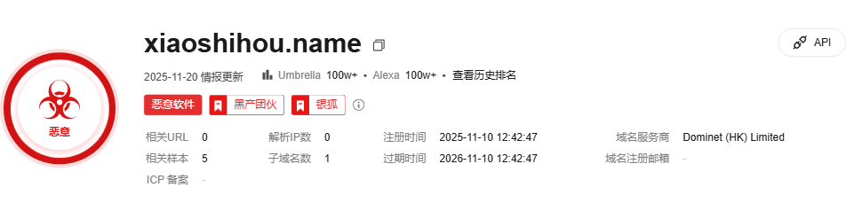
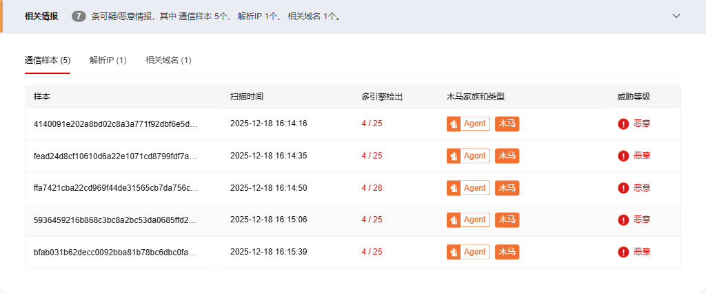
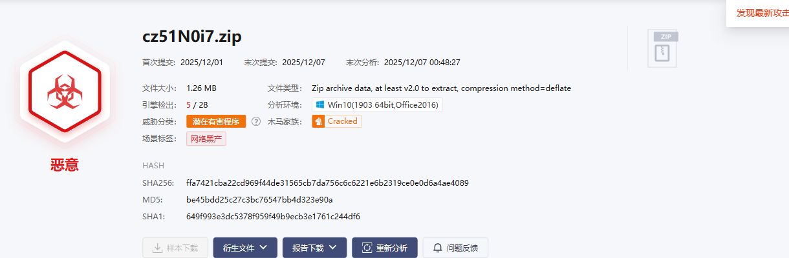
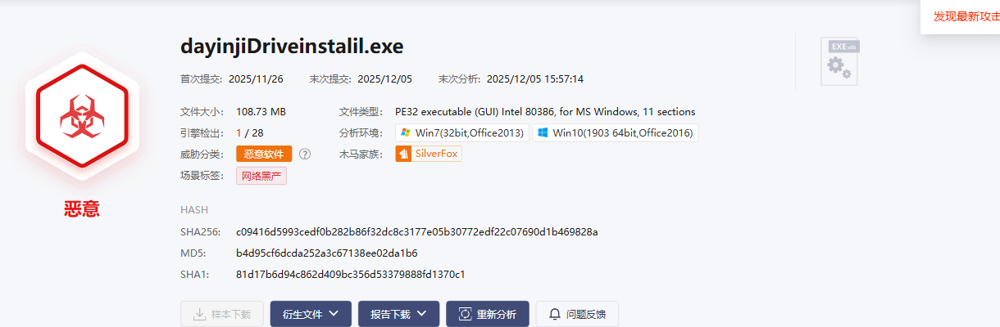
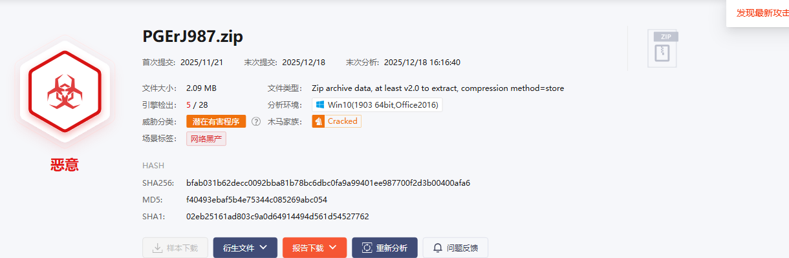

# DOMAIN 威胁分析报告

**目标**: xiaoshihou.name  
**查询时间**: 2025-12-05 01:32:02  
**数据来源**: 微步在线威胁情报平台

---

## 基本信息

---

## 威胁情报详情

### 微步情报

### 相关情报

---

## 相关样本

**相关样本数量**: 5

📝 由于数量限制，我们只获取第一页的内容。

| 文件名称 | 类型 | 扫描时间 | SHA256 | 多引擎检出 | 木马家族和类型 | 威胁等级 |
| --- | --- | --- | --- | --- | --- | --- |
| cy5YCBff.zip | Zip | 2025-12-05 13:00:54 | fead24d8cf10610d6a22e1071cd8799fdf7a099128daa19ac1ec22a9335d9e0b | 3 / 28 | Agent木马 | 恶意 |
| cz51N0i7.zip | Zip | 2025-12-07 00:46:56 | ffa7421cba22cd969f44de31565cb7da756c6c6221e6b2319ce0e0d6a4ae4089 | 4 / 28 | Agent木马 | 恶意 |
| EfmwdZdb.rar | RAR | 2025-12-07 00:47:12 | 5936459216b868c3bc8a2bc53da0685ffd248dc0c88151d2ad21a5e2060ffa2e | 4 / 28 | Agent木马 | 恶意 |
| dayinjiDriveinstalil.exe | EXEx86 | 2025-12-05 15:55:42 | c09416d5993cedf0b282b86f32dc8c3177e05b30772edf22c07690d1b469828a | 1 / 28 | MalGeneric恶意软件 | 恶意 |
| PGErJ987.zip | Zip | 2025-12-07 00:47:44 | bfab031b62decc0092bba81b78bc6dbc0fa9a99401ee987700f2d3b00400afa6 | 4 / 28 | Agent木马 | 恶意 |

💾 详细数据已保存为CSV文件: `xiaoshihou.name_threat_data.csv`

---

## 样本常见释放路径分析

### SHA256: fead24d8cf10610d6a22e1071cd8799fdf7a099128daa19ac1ec22a9335d9e0b

#### Win10(1903 64bit,Office2016)环境下常见释放路径
无

### SHA256: ffa7421cba22cd969f44de31565cb7da756c6c6221e6b2319ce0e0d6a4ae4089

#### Win10(1903 64bit,Office2016)环境下常见释放路径
无

### SHA256: 5936459216b868c3bc8a2bc53da0685ffd248dc0c88151d2ad21a5e2060ffa2e

#### Win10(1903 64bit,Office2016)环境下常见释放路径
无

### SHA256: c09416d5993cedf0b282b86f32dc8c3177e05b30772edf22c07690d1b469828a

#### Win7(32bit,Office2013)环境下常见释放路径

#### Win10(1903 64bit,Office2016)环境下常见释放路径

**常见释放文件位置** (5 个)

- {3DA71D5A-20CC-432F-A115-DFE92379E91F}.3.ver0x0000000000000095.db(145.55 KB)
文件类型：
data
文件路径：
C:\Users\Administrator\AppData\Local\Microsoft\Windows\Caches\{3DA71D5A-20CC-432F-A115-DFE92379E91F}.3.ver0x0000000000000095.db
SHA256：
9057a2d0a5fb3f34f923e2f4d84044ef24399b22f38b614fe111aa2065a82ed4

- _setup64.tmp(6 KB)
文件类型：
PE32+ executable (console) x86-64, for MS Windows
文件路径：
C:\Users\Administrator\AppData\Local\Temp\is-E5HHD.tmp\_isetup\_setup64.tmp
SHA256：
388a796580234efc95f3b1c70ad4cb44bfddc7ba0f9203bf4902b9929b136f95

- dayinjiDriveinstalil.tmp(3.73 MB)
文件类型：
PE32 executable (GUI) Intel 80386, for MS Windows
文件路径：
C:\Users\Administrator\AppData\Local\Temp\is-JPOKB.tmp\dayinjiDriveinstalil.tmp
SHA256：
851d2166ab2ad8ee52eccf65e4bc8d7ea185e4af7328678f00d7f7bd8b16c42d

- is-5MGMP.tmp(104.84 MB)
文件类型：
PE32 executable (GUI) Intel 80386, for MS Windows
文件路径：
C:\Users\Administrator\AppData\Local\is-5MGMP.tmp
SHA256：
cda8b736e806eeabe8dad68faafe37749bc7ea88b6a3fd03db8b53513ec0cbfc

- is-NS9ST.tmp(3.75 MB)
文件类型：
PE32 executable (GUI) Intel 80386, for MS Windows
文件路径：
C:\Users\Administrator\AppData\Local\is-NS9ST.tmp
SHA256：
9aad3dc5a617ce1643b241b5616aeeecd9722db5db030c242d2291d19de39529

### SHA256: bfab031b62decc0092bba81b78bc6dbc0fa9a99401ee987700f2d3b00400afa6

#### Win10(1903 64bit,Office2016)环境下常见释放路径
无
